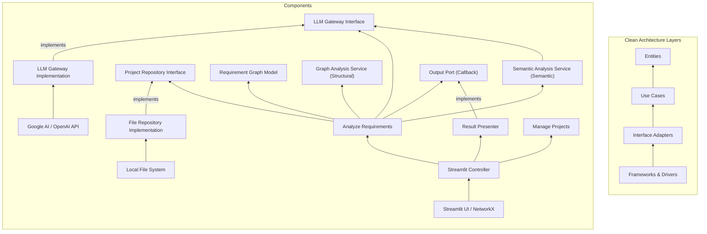
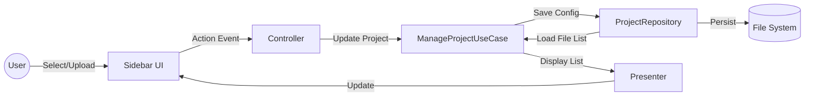
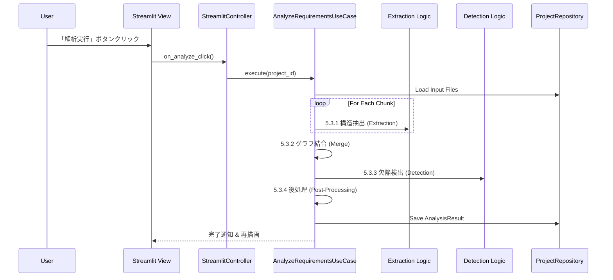
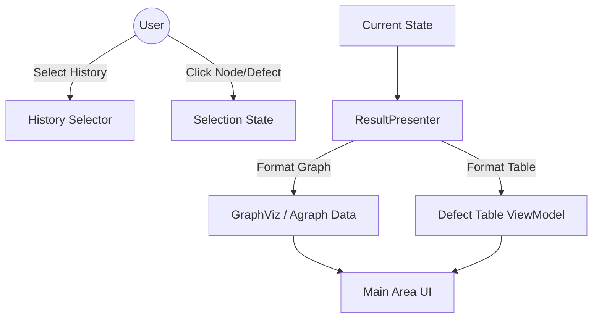

# アーキテクチャ仕様書 (Architecture Specification) - Clean Architecture Detail

## 1. 設計方針
本システムは **Clean Architecture** の原則に従い、関心の分離と依存性のルール（内側への一方通行）を厳守する。

### レイヤー構造
1. **Entities**: ドメインモデル。
2. **Use Cases**: アプリケーションロジック。
3. **Interface Adapters**: 外部と内部の中継。
4. **Frameworks & Drivers**: 技術的詳細。

## 2. 構造図 (Layered Architecture)



## 3. コンポーネント詳細

### 3.1 Entities (コア・ドメイン)

#### Value Objects & Enums (型定義)

誤用を防ぎ、コードの意図を明確にするために以下の型を使用する。

```python
from enum import Enum
from typing import NewType

# Value Objects (IDs)
ProjectId = NewType('ProjectId', str)
NodeId = NewType('NodeId', str)

# Enums
class NodeType(str, Enum):
    ACTOR = "actor"
    ACTION = "action"
    CONDITION = "condition"
    TERMINATOR = "terminator"

class EdgeType(str, Enum):
    DEPENDS_ON = "depends_on"
    CONTRADICTS = "contradicts"
    REFINES = "refines"

class DefectType(str, Enum):
    DEAD_END = "DeadEnd"
    CYCLE = "Cycle"
    MISSING_ELSE = "MissingElse"
    CONFLICT = "Conflict"

class Severity(str, Enum):
    HIGH = "High"
    MEDIUM = "Medium"
    LOW = "Low"
```

#### `Project` (Aggregate Root)
- **役割**: 解析タスクの管理単位。
- **データ構造**:
  ```python
  class Project(BaseModel):
      id: ProjectId
      name: str
      created_at: datetime
      config: ProjectConfig
      input_files: List[str]  # ファイルパスのリスト
  ```

#### `Defect` (Value Object)
- **役割**: 検出された論理的欠陥。
- **データ構造**:
  ```python
  class Defect(BaseModel):
      type: DefectType
      severity: Severity
      related_node_ids: List[NodeId]
      description: str
      suggestion: Optional[str]
  ```

#### `RequirementNode` (Data Class)
- **役割**: 要求仕様の最小構成単位。
- **データ構造**:
  ```python
  class RequirementNode(BaseModel):
      id: NodeId
      content: str
      type: NodeType
      source_file: str
      line_number: int
  ```

#### `RequirementEdge` (Data Class)
- **役割**: 要求間の関係性。
- **データ構造**:
  ```python
  class RequirementEdge(BaseModel):
      source_id: NodeId
      target_id: NodeId
      type: EdgeType
      attributes: Dict[str, Any]
  ```

#### `RequirementGraph` (Domain Service / Model)
- **役割**: ノード間の接続関係とグラフ操作。
- **インターフェース**:
  ```python
  class RequirementGraph:
      nodes: Dict[NodeId, RequirementNode]
      edges: List[RequirementEdge]
      def add_node(self, node: RequirementNode): ...
      def get_orphans(self) -> List[RequirementNode]: ...
      def to_networkx(self) -> nx.DiGraph: ...
  ```

#### `GraphAnalysisService` (Domain Service)
- **役割**: グラフ理論に基づく構造解析ロジック。
- **インターフェース**:
  ```python
  class GraphAnalysisService:
      def detect_dead_ends(self, graph: RequirementGraph) -> List[Defect]: ...
      def detect_cycles(self, graph: RequirementGraph) -> List[Defect]: ...
  ```

#### `SemanticAnalysisService` (Domain Service)
- **役割**: 自然言語理解に基づく意味解析ロジック。
- **インターフェース**:
  ```python
  class SemanticAnalysisService:
      def __init__(self, llm_gateway: LLMGateway): ...
      def detect_missing_else(self, graph: RequirementGraph) -> List[Defect]: ...
      def detect_conflicts(self, graph: RequirementGraph) -> List[Defect]: ...
  ```

#### `AnalysisResult` (Data Class)
- **役割**: 1回の解析セッションの結果集約。
- **データ構造**:
  ```python
  class AnalysisResult(BaseModel):
      timestamp: datetime
      graph: RequirementGraph
      defects: List[Defect]
      metrics: Dict[str, float]
  ```

---

### 3.2 Use Cases (アプリケーション・ロジック)

#### `AnalyzeRequirementsUseCase` (Interactor)
- **インターフェース**:
  ```python
  class AnalyzeRequirementsUseCase(ABC):
      @abstractmethod
      def execute(self, project_id: ProjectId, options: AnalysisOptions) -> AnalysisResult: ...
  ```

#### `ManageProjectUseCase` (Interactor)
- **インターフェース**:
  ```python
  class ManageProjectUseCase(ABC):
      def create_project(self, name: str) -> Project: ...
      def list_projects(self) -> List[ProjectSummary]: ...
  ```

---

### 3.3 Interface Adapters (中継層)

#### `StreamlitController` (Controller)
- **インターフェース**:
  ```python
  class StreamlitController:
      def on_analyze_click(self, project_id: ProjectId): ...
  ```

#### `ResultPresenter` (Presenter)
- **インターフェース**:
  ```python
  class ResultPresenter:
      def present(self, result: AnalysisResult) -> AnalysisViewModel: ...
  ```

#### `ProjectRepository` (Port/Interface)
- **インターフェース**:
  ```python
  class ProjectRepository(ABC):
      def save(self, project: Project): ...
      def save_result(self, project_id: ProjectId, result: AnalysisResult): ...
      def find_by_id(self, id: ProjectId) -> Optional[Project]: ...
  ```

#### `LLMGateway` (Port/Interface)
- **インターフェース**:
  ```python
  class LLMGateway(ABC):
      def extract_structure(self, text: str) -> Dict: ...
      def verify_condition_exhaustiveness(self, condition: str, outgoing_paths: List[str]) -> Dict[str, Any]: ...
      def check_text_contradiction(self, text_a: str, text_b: str) -> Dict[str, Any]: ...
  ```

---

### 3.4 Frameworks & Drivers (外部サービス・詳細)

#### 実装詳細 (Implementation Details)
- **UI**: `Streamlit`
- **Graph Lib**: `NetworkX`
- **LLM SDKs**: `google-generativeai`, `openai`

#### データ永続化 (Data Persistence)
- **プロジェクト構造**:
  ```
  /projects/{id}/
    project.yaml
    /reports/{timestamp}/
       result.json
  ```
- **シリアライズ形式**:
  - Value Object や Enum は、シリアライズ時にはその基礎となる型（文字列）として保存する。

## 4. 依存性のルール
- **内向きの依存**: `Frameworks` -> `Adapters` -> `Use Cases` -> `Entities`.

## 5. 詳細機能仕様 (Detailed Functional Specifications)

ここでは、ユーザーが触れる「UI機能」を起点として、各機能の役割、内部データフロー (DFD)、および構成要素の詳細を定義する。

### 5.1 UI機能マップ (UI Function Map)

本システムは大きく3つの機能エリアを提供する。

1.  **プロジェクト・ファイル管理機能**: サイドバーにて、解析対象のプロジェクト切替やファイルの追加・削除を行う。
2.  **解析実行機能**: メインエリアにて、設定されたファイルに対して解析を実行し、結果を生成する。
3.  **結果表示・履歴機能**: 解析結果をグラフとテーブルでインタラクティブに可視化し、エビデンスを確認する。

### 5.2 プロジェクト・ファイル管理機能 (Project & File Management)

#### 機能概要
- ユーザーは任意のディレクトリをプロジェクトとして認識させる。
- 解析対象となるドキュメントファイル（Markdown, PDF等）をアップロードまたは指定ディレクトリからロードする。
- ターゲットから除外したいファイルをリストから削除する。

#### DFD: ファイル管理フロー


#### 要素詳細
- **UI Component**: `st.sidebar`, `st.file_uploader`
- **ManageProjectUseCase**: プロジェクト設定 (`project.yaml`) の更新と、解析対象ファイルリストの管理を行う。
- **ProjectRepository**: 物理ファイルシステムへのアクセスを抽象化し、ファイルの保存や削除を実行する。

---

### 5.3 解析実行機能 (Analysis Execution Function)

#### 機能概要
- プロジェクトに登録されている全ての入力ドキュメントを一括で読み込み、構造化と欠陥検出を行う（個別のファイル選択は不要）。
- 処理の進捗状況（プログレスバー）と、LLMとの通信ログをリアルタイムに表示する。
- 最終的に `AnalysisResult` を生成し、永続化する。

#### DFD: 解析実行フロー (全体)


#### 5.3.1 内部ロジック詳細: 構造抽出 (Extraction)
テキストを構造化グラフデータへ変換するサブプロセス。

1.  **テキスト分割 (Chunking)**:
    - ドキュメントを固定長または意味単位（段落、ヘッダー）で分割する。
    - **オーバーラップ**: 文脈分断を防ぐため、前後のチャンクと `N` 文字（例: 500文字）重複させる。
2.  **LLM抽出 (Extraction)**:
    - 各チャンクに対し `LLMGateway` を呼び出す。
    - **Prompt**: 「入力テキストから要件ノードとエッジを抽出し、指定されたJSONスキーマで出力せよ」。文脈として重複テキストも与える。
3.  **バリデーション & リトライ (Validation & Retry)**:
    - `ExtractionError` (JSONパース失敗等) が発生した場合、1回だけリトライを行う。
    - リトライ失敗、またはAPIエラー時は `ProcessingError` を送出し、処理全体を中断する (**All-or-Nothing Rule**)。

#### 5.3.2 内部ロジック詳細: グラフ結合 (Graph Construction)
分割処理された各チャンクから得られた `RequirementNode` / `RequirementEdge` のリストを、一つの `RequirementGraph` に統合する。

- **マージ戦略 (Merging Strategy)**:
    - 同じ `id` を持つノードが見つかった場合、これらを同一ノードとして扱う。
    - 属性（`content` 等）が異なる場合は、より情報量の多い方、または後勝ちで採用する。
    - ノードが存在しない（未定義の）IDを参照しているエッジは、不整合として記録し、グラフには含めない（またはプレースホルダーノードを作成する）。

#### 5.3.3 内部ロジック詳細: 欠陥検出 (Detection)
統合されたグラフに対して、構造的・意味的な欠陥を検出する。

| 欠陥タイプ | コンポーネント | アルゴリズム詳細 / 条件 |
| :--- | :--- | :--- |
| **Dead End** | `GraphAnalysisService` | 1. 全ノード走査。<br>2. `out_degree == 0` かつ `node.type != TERMINATOR` の場合、欠陥とする。<br>3. `severity` は `HIGH`。 |
| **Cycle** | `GraphAnalysisService` | 1. `networkx.simple_cycles(G)` を実行。<br>2. 検出された各サイクルについて、自己ループかどうかチェック。<br>3. 自己ループ以外は欠陥リストに追加。 |
| **Missing Else** | `SemanticAnalysisService` | 1. `type == CONDITION` のノードを抽出。<br>2. 各ノードの `out_edges` のラベルリストを取得。<br>3. `LLMGateway.verify_exhaustiveness` をコール。<br>4. "No" ならば `Defect(MissingElse)` を生成。 |
| **Conflict** | `SemanticAnalysisService` | 1. 依存関係にあるノードペアをリストアップ。<br>2. `LLMGateway.check_contradiction` をコール。<br>3. 確度が高い矛盾のみ `Defect(Conflict)` として生成。 |

#### 5.3.4 内部ロジック詳細: 後処理 (Post-Processing)
結果を集約し、メトリクスを計算して保存する。
- **メトリクス計算**: ノード総数、エッジ総数、グラフ密度、孤立ノード数などを計算。
- **永続化**: `RequirementGraph` オブジェクトと検出された `List[Defect]`、メトリクスを `AnalysisResult` に格納し、`result.json` としてシリアライズ保存する。

---

### 5.4 結果表示・履歴機能 (Result Visualization & History)

#### 機能概要
- 解析結果のグラフを可視化する（ズーム、パン可能）。
- 検出された欠陥をリスト表示し、各欠陥をクリックすると該当ノードとエビデンス（引用文）をハイライトする。
- 過去の解析履歴を選択し、過去の状態を復元表示する。

#### DFD: 表示・操作フロー


#### 要素詳細
- **Main Area UI**: `streamlit-agraph` を使用してインタラクティブなネットワーク図を描画。
- **ResultPresenter**:
    - `AnalysisResult` (Entities) を受け取り、UIコンポーネントが描画しやすいデータ形式 (ViewModel) に変換する責務を持つ。
    - 特にグラフデータはライブラリ固有の形式（Configオブジェクトなど）へ変換する。
