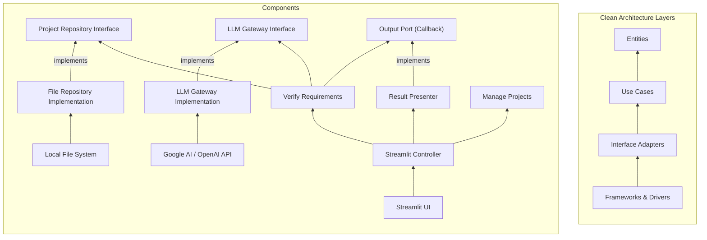
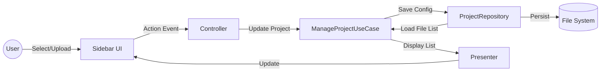
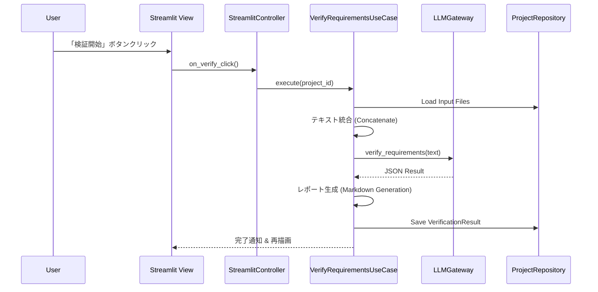
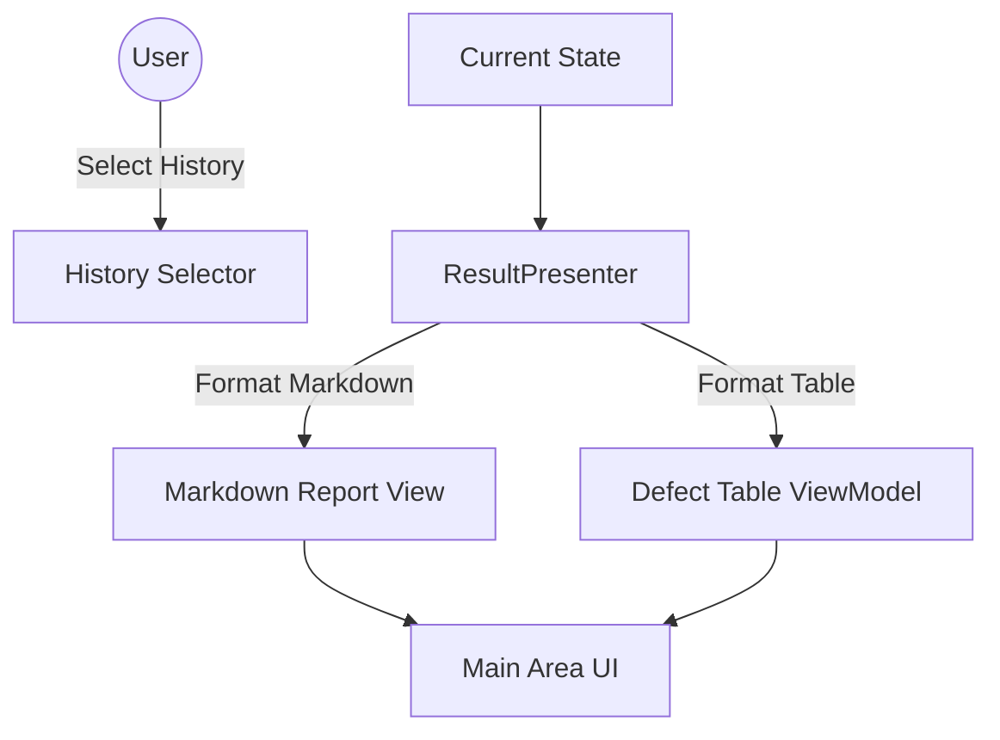

# アーキテクチャ仕様書 (Architecture Specification) - Clean Architecture Detail

## 1. 設計方針
本システムは **Clean Architecture** の原則に従い、関心の分離と依存性のルール（内側への一方通行）を厳守する。

### レイヤー構造
1. **Entities**: ドメインモデル。
2. **Use Cases**: アプリケーションロジック。
3. **Interface Adapters**: 外部と内部の中継。
4. **Frameworks & Drivers**: 技術的詳細。

## 2. 構造図 (Layered Architecture)



## 3. コンポーネント詳細

### 3.1 Entities (コア・ドメイン)

#### Value Objects & Enums (型定義)

誤用を防ぎ、コードの意図を明確にするために以下の型を使用する。

```python
from enum import Enum
from typing import NewType, List, Optional, Dict, Any
from datetime import datetime
from pydantic import BaseModel

# Value Objects (IDs)
ProjectId = NewType('ProjectId', str)

# Enums
class DefectCategory(str, Enum):
    DEAD_ENDS = "Dead Ends"
    MISSING_ELSE = "Missing Else"
    ORPHAN_STATES = "Orphan States"
    CONFLICTING_OUTPUTS = "Conflicting Outputs"
    UNSTATED_SIDE_EFFECTS = "Unstated Side Effects"
    TIMING_VIOLATION = "Timing Violation"
    CYCLES = "Cycles"
    AMBIGUOUS_TERMS = "Ambiguous Terms"

class Severity(str, Enum):
    CRITICAL = "Critical"
    MAJOR = "Major"
    MINOR = "Minor"
```

#### `Project` (Aggregate Root)
- **役割**: 解析タスクの管理単位。
- **データ構造**:
  ```python
  class ProjectConfig(BaseModel):
      description: Optional[str] = None

  class Project(BaseModel):
      id: ProjectId
      name: str
      created_at: datetime
      config: ProjectConfig
      input_files: List[str]  # ファイルパスのリスト
  ```

#### `Defect` (Value Object)
- **役割**: LLMによって検出された欠陥。
- **データ構造**:
  ```python
  class Defect(BaseModel):
      id: str
      category: DefectCategory
      severity: Severity
      location: str
      description: str
      recommendation: str
  ```

#### `VerificationResult` (Data Class)
- **役割**: 1回の検証セッションの結果集約。
- **データ構造**:
  ```python
  class VerificationResult(BaseModel):
      timestamp: datetime
      summary: str
      defects: List[Defect]
      raw_report: str # Markdown report
  ```

---

### 3.2 Use Cases (アプリケーション・ロジック)

#### `VerifyRequirementsUseCase` (Interactor)
- **インターフェース**:
  ```python
  from abc import ABC, abstractmethod
  
  class VerifyRequirementsUseCase(ABC):
      @abstractmethod
      def execute(self, project_id: ProjectId) -> VerificationResult: ...
  ```

#### `ManageProjectUseCase` (Interactor)
- **インターフェース**:
  ```python
  class ProjectSummary(BaseModel):
      id: str
      name: str
      file_count: int

  class ManageProjectUseCase(ABC):
      @abstractmethod
      def create_project(self, name: str) -> Project: ...
      @abstractmethod
      def list_projects(self) -> List[ProjectSummary]: ...
  ```

---

### 3.3 Interface Adapters (中継層)

#### `StreamlitController` (Controller)
- **インターフェース**:
  ```python
  class StreamlitController:
      def on_verify_click(self, project_id: ProjectId): ...
  ```

#### `ResultPresenter` (Presenter)
- **インターフェース**:
  ```python
  class VerificationViewModel(BaseModel):
       report_markdown: str
       defect_table_data: List[Dict]

  class ResultPresenter:
      def present(self, result: VerificationResult) -> VerificationViewModel: ...
  ```

#### `ProjectRepository` (Port/Interface)
- **インターフェース**:
  ```python
  class ProjectRepository(ABC):
      def save(self, project: Project): ...
      def save_result(self, project_id: ProjectId, result: VerificationResult): ...
      def find_by_id(self, id: ProjectId) -> Optional[Project]: ...
  ```

#### `LLMGateway` (Port/Interface)
- **インターフェース**:
  ```python
  class LLMGateway(ABC):
      def verify_requirements(self, combined_text: str) -> Dict: ...
  ```

---

### 3.4 Frameworks & Drivers (外部サービス・詳細)

#### 実装詳細 (Implementation Details)
- **UI**: `Streamlit`
- **LLM SDKs**: `google-generativeai`, `openai`

#### データ永続化 (Data Persistence)
- **プロジェクト構造**:
  ```
  /projects/{id}/
    project.yaml
    /reports/{timestamp}/
       report.md
       result.json
  ```

## 4. 依存性のルール
- **内向きの依存**: `Frameworks` -> `Adapters` -> `Use Cases` -> `Entities`.

## 5. 詳細機能仕様 (Detailed Functional Specifications)

### 5.1 UI機能マップ (UI Function Map)

本システムは大きく3つの機能エリアを提供する。

1.  **プロジェクト・ファイル管理機能**: サイドバーにて、解析対象のプロジェクト切替やファイルの追加・削除を行う。
2.  **検証実行機能**: メインエリアにて、設定されたファイルに対してLLM検証を実行し、結果を生成する。
3.  **レポート表示・履歴機能**: 検証レポートを表示し、エビデンスを確認する。

### 5.2 プロジェクト・ファイル管理機能 (Project & File Management)

#### 機能概要
- ユーザーは任意のディレクトリをプロジェクトとして認識させる。
- 解析対象となるドキュメントファイル（Markdown, PDF等）をアップロードまたは指定ディレクトリからロードする。
- ターゲットから除外したいファイルをリストから削除する。

#### DFD: ファイル管理フロー


---

### 5.3 検証実行機能 (Verification Execution Function)

#### 機能概要
- プロジェクトに登録されている全ての入力ドキュメントを一括で読み込み、LLMによる包括的な検証を行う。
- 処理の進捗状況とログを表示する。
- 最終的に `VerificationResult` を生成し、永続化する。

#### DFD: 検証実行フロー


#### 5.3.1 内部ロジック詳細: テキスト統合 & LLM検証
1.  **テキスト統合**: 対象となる全てのMarkdownファイルを読み込み、ファイル名をヘッダーとして結合する。
2.  **プロンプト構築**: `prompts/verify_requirements_llm.md` をロードし、統合したテキストを埋め込む。
3.  **LLM実行**: LLM APIを呼び出し、JSON形式での回答を取得する。
    - **Defect Taxonomy**: `doc/defect_taxonomy.md` に基づいた8つのカテゴリで欠陥を検出する。
    - **Prompting Strategy**: Chain-of-ThoughtやRole Promptingを活用し、QAエンジニアとしての振る舞いを指示する。

---

### 5.4 レポート表示・履歴機能 (Result Visualization & History)

#### 機能概要
- LLMが生成したMarkdownレポートを表示する。
- 検出された欠陥(Defect)をインタラクティブなリストとして表示し、フィルタリング可能にする。
- 過去の解析履歴を選択し、過去のレポートを表示する。

#### DFD: 表示・操作フロー

