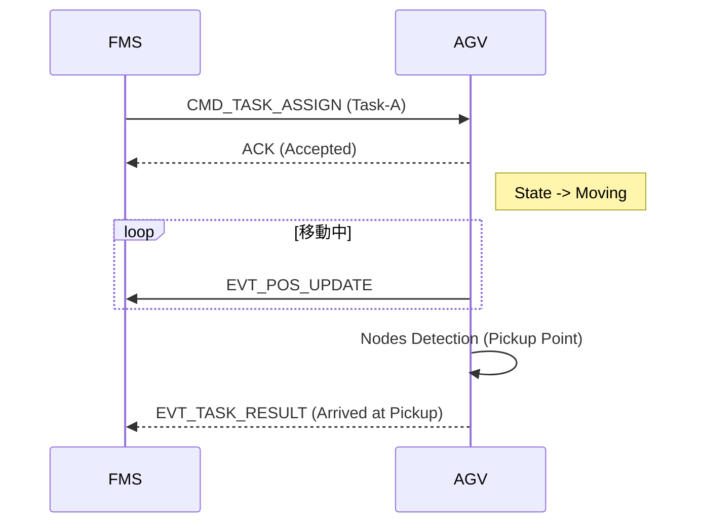

# 無人搬送車 (AGV) フリート管理システム - 詳細要求仕様書 (Part 2/3)
# ドキュメントID: RSS-AGV-002
# タイトル: 通信プロトコル・FMS連携仕様
# バージョン: 1.0.0

---

## 改版履歴

| 版数 | 日付 | 変更者 | 内容 |
| :--- | :--- | :--- | :--- |
| 0.1.0 | 2025-10-05 | 山田 太郎 | 新規作成 |
| 1.0.0 | 2025-12-20 | 佐藤 花子 | 初版リリース |

---

## 目次

1. 通信アーキテクチャ概要
2. 通信プロトコル詳細
    2.1. メッセージフォーマット
    2.2. コマンド一覧 (FMS -> AGV)
    2.3. イベント報告一覧 (AGV -> FMS)
3. 連携シーケンス
    3.1. 配送タスク受注フロー
    3.2. 交差点・排他制御フロー
    3.3. エラーハンドリング
4. 詳細データ定義

---

## 1. 通信アーキテクチャ概要

### 1.1. 物理・リンク層
- **規格**: IEEE 802.11 ac/ax (WiFi 5/6)
- **周波数**: 5GHz帯（干渉低減のため2.4GHzは使用禁止）
- **認証**: WPA3-Enterprise
- **IPアドレス**: DHCP固定割当

### 1.2. アプリケーション層
- **プロトコル**: MQTT v3.1.1 over TCP/IP
- **QoS**: Level 1 (At least once) を基本とする。
- **Payload**: JSON (UTF-8 Encoded)
- **Topic設計**:
    - Command: `agv/{agv_id}/cmd`
    - Status: `agv/{agv_id}/status`
    - Broadcast: `agv/broadcast`

---

## 2. 通信プロトコル詳細

### 2.1. メッセージフォーマット

全てのメッセージは共通のヘッダーを持つ。

```json
{
  "header": {
    "msg_id": "UUID-v4-string",
    "timestamp": 1735689600000,
    "sender": "AGV-001",
    "version": "1.0"
  },
  "body": {
    ... // 各コマンド個別の内容
  }
}
```

### 2.2. コマンド一覧 (FMS -> AGV)

#### 2.2.1. CMD_MOVE (移動指示)
指定されたノードリストに従って移動する。

- **Body Parameter**:
    - `route_id`: String
    - `nodes`: List<Integer> (通過するノードIDの配列)
    - `final_dest`: Integer

#### 2.2.2. CMD_PAUSE (一時停止)
即時停止を要求する。

- **Body Parameter**:
    - `duration`: Integer (ms, 0の場合は無期限)

#### 2.2.3. CMD_RESUME (再開)
CMD_PAUSEで停止した状態からの復帰。

#### 2.2.4. CMD_TASK_ASSIGN (タスク割当)
新しい配送タスクを割り当てる。

- **Body Parameter**:
    - `task_id`: String
    - `pickup_node`: Integer
    - `dropoff_node`: Integer
    - `priority`: Integer (1-5)

#### 2.2.5. CMD_EMERGENCY_STOP (非常停止)
ソフトウェア的な非常停止。

- **動作仕様**:
    - 受信後、直ちにブレーキを作動させる。
    - ステータスLEDを「赤点滅」にする (LedState = RED_BLINK)。
    - モーター電源を遮断する。

#### 2.2.6. CMD_CHANGE_MODE (モード変更)
Auto/Manual等の論理モード切替。

---

### 2.3. イベント報告一覧 (AGV -> FMS)

#### 2.3.1. EVT_POS_UPDATE (位置更新)
1秒周期、あるいはノード通過時に送信。

```json
{
  "current_node": 101,
  "last_node": 100,
  "distance_from_last": 1500,
  "status": "Moving",
  "battery": 85,
  "error_code": 0
}
```

#### 2.3.2. EVT_TASK_RESULT (タスク結果)
荷積み、荷下ろし、移動完了時に送信。

---

## 3. 連携シーケンス

### 3.1. 配送タスク受注フロー



このフロー自体は標準的である。しかし、AGV側で「ACK」を返したにも関わらず、実際には内部エラーで動けない場合のタイムアウト処理がFMS側仕様に依存している。

### 3.2. 交差点・排他制御フロー (Traffic Control)

複数のAGVが交差点を通過する際の排他制御。

1. **Request**: AGVは交差点の手前ノード（Entry Node）で `REQ_ACQUIRE_RESOURCE` をFMSに送信する。
2. **Grant**: FMSは他AGVがいなければ `RES_GRANT_RESOURCE` を返す。
3. **Pass**: AGVは交差点を通過する。
4. **Release**: AGVは交差点通過後のノード（Exit Node）で `REQ_RELEASE_RESOURCE` を送信する。

---

## 4. 詳細データ定義

### 4.1. エラーコードマップ (Communication Layer)

| Code | Message | Action |
| :--- | :--- | :--- |
| C_001 | JSON Parse Error | 無視してNACK返送 |
| C_002 | Unknown Command | 無視してNACK返送 |
| C_003 | Parameter Out of Range | NACK返送 |
| C_004 | Queue Full | 内部キュー溢れ。Drop。 |
| C_100 | Auth Failed | 切断・再接続 |

### 4.2. LEDインジケータ仕様

AGV上部のステータスライト（パトライト）の点灯パターン定義。

| Pattern ID | Pattern Name | Color | Frequency | Meaning |
| :--- | :--- | :--- | :--- | :--- |
| LED_00 | OFF | N/A | 0Hz | 電源OFF / Sleep |
| LED_01 | GREEN_ON | Green | Solid | 正常稼働・待機中・走行中 |
| LED_02 | BLUE_ROTATE | Blue | 60rpm | 自動運転・タスク実行中 |
| LED_03 | YELLOW_BLINK | Yellow | 1Hz | 一時停止・障害物検知・警告 |
| LED_04 | RED_BLINK | Red | 2Hz | 重大エラー・非常停止 |
| LED_05 | RED_ON | Red | Solid | システムダウン |
| LED_06 | WHITE_PULSE | White | 0.5Hz | 充電中 |
| LED_07 | PURPLE_BLINK | Purple | 1Hz | 通信ロスト・オフライン |

---

## 5. 将来拡張計画 (Roadmap)

### 5.1. V2V通信 (Vehicle to Vehicle)
将来的にはAGV同士が直接通信し、FMSを介さずに譲り合いを行う機能を検討中。
現状のプロトコルには、V2V用のアドレス空間は予約されているが実装は空である。

### 5.2. クラウド連携
FMSを経由せず、メンテナンスデータをクラウドのAIサーバへ直接投げる仕様。
セキュリティ要件が未定のため保留中。

---

(Part 2 終了)
